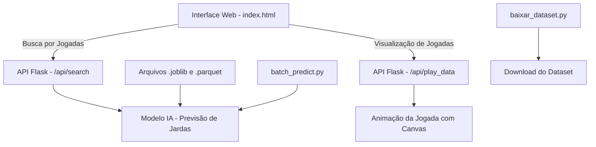
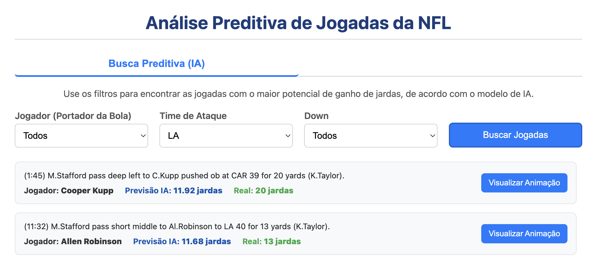
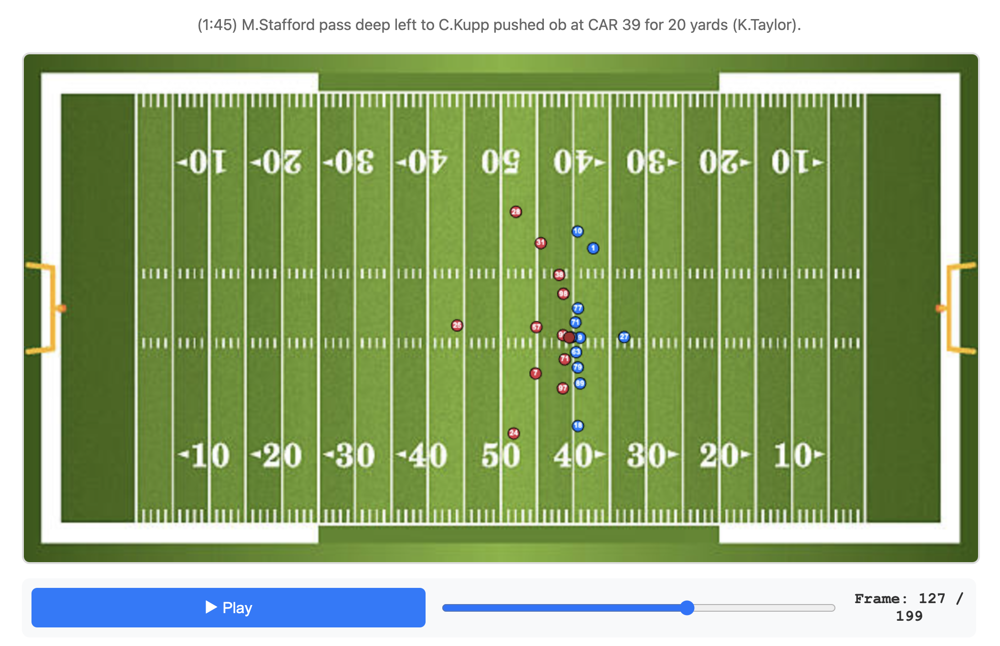

# Analise Preditiva de dados do dataset da NFL

Este projeto treina um modelo de analise preditiva com dados do dataset da NFL e disponibiliza uma API Flask para visualizar uma interface onde o usuário podera ver as jogadas prevista pelo modelo.

---


---

## Requisitos

- Python 3.11 ou superior

## 1. Instalação

### Passo 1: Clone o repositório

```bash
git clone https://github.com/imxder/NFL.git
cd NFL
```

### Passo 2: Crie e ative o ambiente virtual

No Windows:

```bash
python -m venv .venv
.\.venv\Scripts\activate
```

No Linux/macOS:

```bash
python3 -m venv .venv
source .venv/bin/activate
```

### Passo 3: Instale as dependências

```bash
pip install -r requirements.txt
```

## 2. Baixe o DATASET.

- Execute o codigo de `baixar_bataset.py`.

```bash
python baixar_bataset.py
```

Este script deve:

- Baixar a pasta do dataset do Google Drive descomprimir.
- Descomprimir pasta `dataset.zip`.

## 3. Treinar o modelo 

Ao clonar o repositório já vem o modelo treinado,
para treinar novamente basta apagar o conteúdo da pasta `output`.

Execute o treinamento do modelo:

```bash
python train_model.py
```

O que este script faz:

- Carrega os dados das jogadas já convertidos em `.parquet` da pasta `dataset`.
- Treina o modelo.
- Salva os arquinas na pasta `output`

## 4. Gerar jogadas previstas com os modelos treinados

Execute o scipt para gerar o arquivos com as jogadas previstas em `parquet`:

```bash
python batch_predict.py
```

O que este script faz:

- Carrega os modelos treinados da pasta `output`.
- Cria um arquivo `.parquet` com as jogadas previstas.
- Salva o arquivo `plays_with_predictions.parquet` na pasta `output`

## 5. Rodar a API Flask

Para iniciar a API Flask que exibe os produtos e recomendações:

```bash
python app.py
```

Acesse no navegador:

```
http://localhost:5000
```

Você verá a interface web abas para ver as jogadas prevista e suas animações.

---



---



---

## Estrutura dos arquivos
```
/
├── app.py                              # API Flask (Aplicação Principal)
├── baixar_dataset.py                   # Script para baixar o dataset (via gdown)
├── train_model.py                      # Script para treinar modelo 
├── batch_predict.py                    # Script para gerar jogadas previstas
|
├── requirements.txt                    # Dependências do projeto
|
├── static/                             # Arquivos estáticos (CSS, JS)
│   └── css/                   
│       └── style.css│                  # Arquivo CSS para estilização  
│   └── js/                   
│       └── main.js                     # Arquivo javascript
│   └── images/                   
│       └── football_field.png          # Imagem do campo
│
├── templates/                          # Templates HTML do Flask
│   └── index.html                      # Página principal da aplicação
|
└── output/                             # Pasta com modelos já treinados
    ├── model_columns_advanced.joblib
    ├── play_yardage_predictor_advanced.joblib
    └── plays_with_predictions.parquet
```
